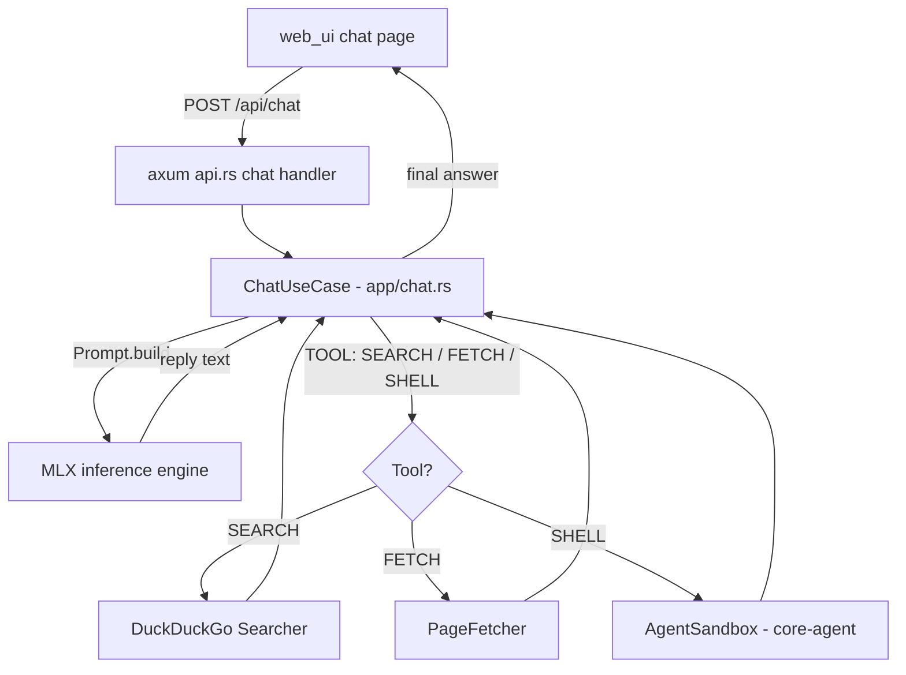
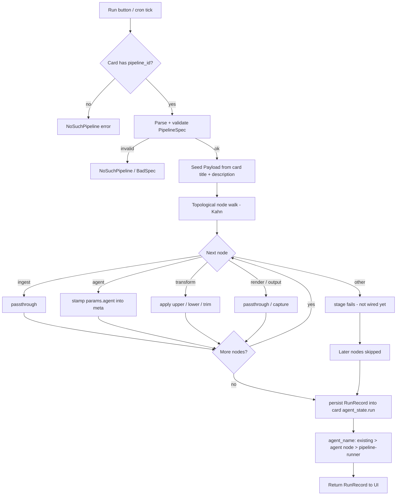
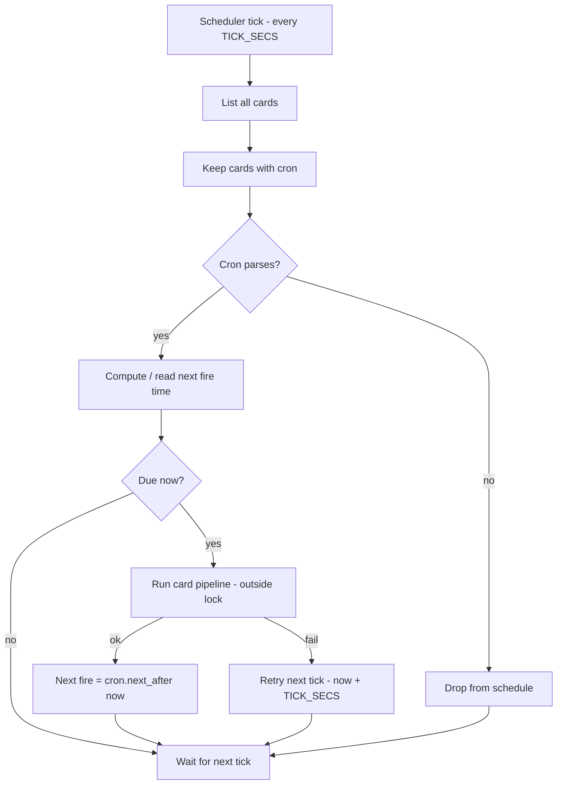

# How the Agent Works from the Web UI

How a chat message typed into `web_ui` becomes an agentic, tool-using answer.

## The big picture

## Step by step

1. **User sends a message** — the web UI calls `POST /api/chat` with
   `{ message, max_tokens?, search?, tokenizer?, think? }`.
   `search` controls tooling: `"off"` = plain chat, `"on"` (force) = always
   web-search first, `"auto"` (default) = the model decides via tools.

2. **Prompt assembly** (`domain/service/prompt.rs`) — `Prompt::build` layers:
   - the `TOOL_INSTRUCTION` block (only in `auto` mode), which tells the model
     it can reply with a single `TOOL: SEARCH|FETCH|SHELL` line,
   - any gathered context (forced search results),
   - the user's message.

3. **Inference** — `ChatUseCase::infer` submits the prompt to the inference
   engine (`Inference` port; wired to `RemoteModel` in `main.rs`) and awaits
   the generated reply.

4. **Agentic tool loop** (Zed-style, `app/chat.rs::execute`):
   - If the reply starts with a `TOOL:` line and the round budget
     (`TOOL_ROUNDS_MAX = 2`) is not exhausted, the tool runs:
     - `TOOL: SEARCH <query>` → `DuckDuckGo` (blocking task), top 5 results
       formatted into context,
     - `TOOL: FETCH <url>` → `PageFetcher` downloads the page into context,
     - `TOOL: SHELL <cmd>` → executed inside the **agent sandbox**.
   - The prompt is rebuilt with accumulated context and the model infers again.
   - When the budget is exhausted but the model still wants a tool, a final
     answer is forced without the tool offer.

5. **Response** — `ChatOutcome` is returned to the UI:
   `{ model, text, searched, stats }`.

## The sandbox (shell tool)

`backend/src/infra/sandbox.rs` wraps `core_agent::sandbox::Sandbox`:

- Created once at backend startup (`AgentSandbox::restore()`); stale sandbox
  dirs from dead processes are purged first.
- Every `TOOL: SHELL` command runs confined in that workspace (per-OS
  implementation under `crates/core-agent/src/sandbox/{macos,linux,windows}.rs`
  with limits: timeout, output size, process/memory caps, network policy).
- The sandbox root doubles as the Codex/Claude CLI workspace
  (`codex_workspace` in `main.rs`).
- Ops endpoints: `GET /api/sandbox` (list dirs + liveness),
  `POST /api/sandbox/purge` (by pid), `POST /api/sandbox/sweep` (remove dead).

## Other agent paths from the web

- **Model selection** — `POST /api/models/select` switches the MLX model the
  agent answers with; `GET /api/models` lists loadable ones (via `hf_loader`).
- **Manager agents** — `POST /api/manager/agents` spawns a named agent with its
  own work tree; `POST /api/manager/agents/{agent}/run` runs a command in it.
- **External CLI agents** — `/api/chat/codex` and `/api/chat/claude` route the
  same chat shape through Codex/Claude CLI after their respective auth flows.

## Kanban cards: agent, pipeline, schedule

A kanban card is the second way to drive an agent from the web. Cards carry
per-card agent state (`agent_name` + `agent_state` JSON) and can have a
pipeline and a cron schedule attached.

### Manual run (Run button / `POST /api/kanban/cards/{id}/run`)

Requires editor+ role. `app/pipeline_run.rs::run_card_pipeline`:

1. Load the card; it must have `pipeline_id` set (else `NoSuchPipeline`).
2. Parse + validate the pipeline's `PipelineSpec` JSON.
3. Seed a text `Payload` from the card's `title` + `description`.
4. Walk nodes in **topological order** (Kahn over `links`; falls back to spec
   order if the graph is broken).
5. Each node transforms the payload; the first failing node marks the run
   failed and every later node is recorded as "skipped".
6. `persist` merges the `RunRecord` into the card's `agent_state` under the
   `"run"` key and sets `agent_name` (keeps an existing one, else takes the
   agent chosen by the pipeline's agent node, else `pipeline-runner`).
7. The `RunRecord` (status, per-stage log, output, finished_at) is returned to
   the UI.

### Pipeline stages currently wired

| Stage | Behavior |
|---|---|
| `ingest` | passthrough; payload already seeded from card text |
| `agent` | reads `params.agent`, stamps it into payload meta → becomes the run's agent name |
| `transform` | `params.op` = `upper` / `lower` / `trim` on the text payload |
| `render` / `output_resource` | passthrough / capture output |
| anything else | stage fails: "not wired to an engine yet" (fetch/search/ref_image/parse/model_infer pending) |

### Scheduled runs (`app/schedule_work.rs`)

- A background task ticks every `TICK_SECS` (started at router build in
  `api.rs::router`).
- Each tick lists all cards, keeps those with a `cron` field (set via
  `PUT /api/kanban/cards/{id}/schedule`), and computes the next fire time
  (`cron.next_after(now)`); entries for cards that lost their cron are dropped.
- When a card is due it runs the **same pipeline runner** as a manual run.
  - Success → next fire time advances normally.
  - Failure → retried on the next tick (`now + TICK_SECS`).
  - Unparseable cron → the card is dropped from the schedule.
- Lock scope is kept tiny: due decisions happen under the write lock, actual
  pipeline runs happen outside it.

### Card agent state API

- `GET /api/kanban/cards/{id}/agent` — read the card's agent state
  (includes the last `run` record after a run).
- `PUT /api/kanban/cards/{id}/agent` — set `agent_name` + arbitrary JSON
  `state` (editor+ role).

## Key constants

| Constant | Value | Meaning |
|---|---|---|
| `TOOL_ROUNDS_MAX` | 2 | max tool rounds before forced final answer |
| `CONTEXT_RESULTS_MAX` | 5 | search results fed into a prompt |
| `TICK_SECS` | (schedule_work.rs) | scheduler poll interval |
