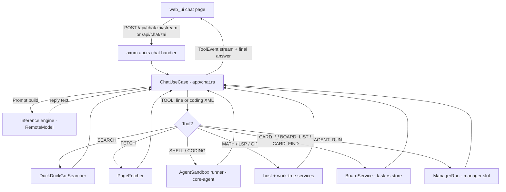
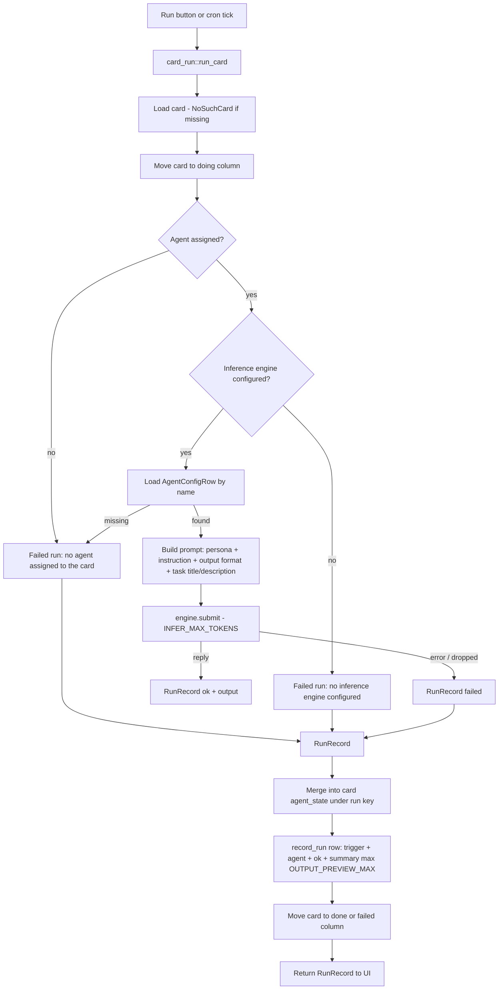
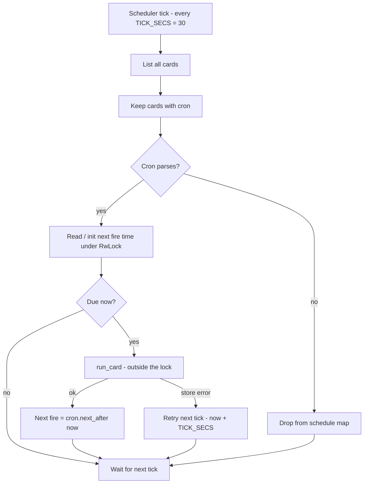

# How the Agent Works from the Web UI

How a chat message typed into `web_ui` becomes an agentic, tool-using answer.

## The big picture

## Step by step

1. **User sends a message** — the web UI calls `POST /api/chat/zai` (JSON
   reply), `POST /api/chat/zai/stream` (SSE), or `POST /api/chat` (local MLX
   model). The request carries `{ message, agent?, thread_id?, card_id?,
   run_id?, max_tokens?, search?, tokenizer?, think? }`.
   `search` controls tooling: `"off"` = plain chat, `"on"` (force) = always
   web-search first, `"auto"` (default) = the model decides via tools.
   `run_id` enables cancellation via `POST /api/chat/zai/cancel`.

2. **Prompt assembly** (`domain/service/prompt.rs`) — `Prompt::build` layers
   one instruction block per enabled tool family (`Section` enum + match):
   `TOOL_WEB_INSTRUCTION`, `TOOL_SHELL_INSTRUCTION`, `TOOL_CODING_INSTRUCTION`,
   `TOOL_MATH_INSTRUCTION`, `TOOL_GIT_INSTRUCTION`, `TOOL_LSP_INSTRUCTION`,
   `TOOL_AGENT_RUN_INSTRUCTION`, `BOARD_TOOL_INSTRUCTION`, plus `TOOL_RULES`.
   All tools use plain `TOOL:` lines; the one exception is the coding tool,
   which replies with an `<invoke name="coding">` XML block (the only XML
   form allowed — the parser also accepts the `write_file` alias).

3. **Inference** — `ChatUseCase::infer` submits the prompt to the inference
   engine (`Inference` port; `RemoteModel` wired in `main.rs`).

4. **Agentic tool loop** (Zed-style, `app/chat.rs::execute`):
   - While the reply parses as a `ToolCall` (`ToolCall::parse` handles both
     `TOOL:` lines and XML invokes) and the round budget
     (`TOOL_ROUNDS_MAX = 8`) is not exhausted, the tool runs:
     - `TOOL: SEARCH <query>` → `DuckDuckGo` (blocking task), top
       `CONTEXT_RESULTS_MAX = 5` results formatted into context,
     - `TOOL: FETCH <url>` → `PageFetcher` downloads the page into context,
     - `TOOL: SHELL <cmd>` → executed inside the **agent sandbox**; output is
       scanned for produced files (max `ARTIFACT_SCAN_MAX = 8` per run),
     - `TOOL: CODING` (XML block, alias `write_file`) → writes a file into the
       work tree (only offered when the work tree is a git repo),
     - `TOOL: MATH <subcommand> …` (alias `GEOMATH`) → exact geometry math,
     - `TOOL: GIT <OP>` → `CLONE`/`STATUS`/`DIFF` run on the host work tree;
       `BRANCH`/`COMMIT`/`PUSH`/`PR` run inside a named agent's container
       (selected by trailing `@<agent>` on the line),
     - `TOOL: LSP DEFINITION|REFERENCES|HOVER <path> <line> <col>` →
       rust-analyzer over the work tree,
     - `TOOL: CARD_FIND | BOARD_LIST | CARD_CREATE | CARD_AGENT | CARD_IMAGE |
       CARD_ROUTINE | CARD_ROUTINE_CLEAR | CARD_RUN` → task-board operations
       through `BoardService`,
     - `TOOL: AGENT_RUN <agent> <cmd>` → runs one command as a named agent in
       its own sandbox (see `docs/agent-run-tool.md`).
   - Every finished call is emitted as a `ToolEvent` over a broadcast channel
     (`with_tool_events`); the SSE stream handler forwards them live to the UI.
   - Tool results join the context, the prompt is rebuilt, the model infers
     again. Disallowed tools yield `TOOL_DENIED`; a mid-loop inference error
     falls back to the last good reply.
   - When the budget is exhausted but the model still wants a tool, a final
     answer is forced without the tool offer.

5. **Response** — `ChatOutcome` is returned to the UI: model text, search
   flag, stats, tool trace, and any artifacts persisted as card resources
   (images ≤ `RESOURCE_IMAGE_MAX_BYTES` inlined as data URLs, text truncated
   to `RESOURCE_TEXT_MAX_CHARS`).

## The sandbox (shell tool)

`backend/src/infra/podman.rs` wraps `core_agent::sandbox::Sandbox` as
`AgentSandbox`:

- Created once at backend startup (`AgentSandbox::restore()`); stale sandbox
  dirs from dead processes are purged first.
- Every `TOOL: SHELL` command runs confined in that workspace (per-OS
  implementation under `crates/core-agent/src/sandbox/{macos,linux,windows}.rs`
  with limits: timeout, output size, process/memory caps, network policy).
- Coding threads get their own per-thread sandbox runner
  (`turn_runner` in `chat.rs`).
- The sandbox root doubles as the Codex/Claude CLI workspace
  (`codex_workspace` in `main.rs`).
- Ops endpoints: `GET /api/sandbox` (list dirs + liveness),
  `POST /api/sandbox/purge` (by pid), `POST /api/sandbox/sweep` (remove dead).

## Other agent paths from the web

- **Model selection** — `POST /api/models/select` switches the model the agent
  answers with; `GET /api/models` lists loadable ones (via `hf_loader`).
- **Manager agents** — named agents with their own work trees, spawned on
  demand; the chat reaches them with `TOOL: AGENT_RUN` (or
  `POST /api/manager/agents/{agent}/run` directly).
- **External CLI agents** — `/api/chat/codex` and `/api/chat/claude` route the
  same chat shape through Codex/Claude CLI after their respective auth flows.
- **Threads** — `GET/POST /api/chat/threads`, `GET/DELETE
  /api/chat/threads/{id}`; per-thread memory recall feeds past exchanges into
  the prompt.

## Task cards: agent runs and routines

A task card is the second way to drive an agent from the web. Cards carry
per-card agent state (`agent_name` + `agent_state` JSON), an optional sandbox
`image`, and an optional cron routine. There are **no pipelines anymore**:
a card run submits the card's task to its assigned agent's configured model —
the agent's own tools (shell, fetch, search, git, …) do the real work from a
chat turn.

### Manual run (`POST /api/task/cards/{id}/run`)

Requires editor+ role. `app/card_run.rs::run_card`:

1. Load the card; missing id → `NoSuchCard`.
2. Move the card to the **doing** column (no-op if already there).
3. If no `agent_name` is assigned, or the agent config is missing, or no
   inference engine is configured, the run still **records a failure** (so the
   card moves on instead of silently staying put).
4. Otherwise build a prompt from the agent config (`persona:`, `instruction:`,
   `output format:` sections, when non-empty) + the card's `title` +
   `description`, and submit it to the engine with `INFER_MAX_TOKENS`.
5. `persist` merges the `RunRecord` into the card's `agent_state` under the
   `"run"` key (ledger only — the pinned `agent_name` preference is never
   mutated by a run), appends a `run_records` row (trigger, agent, ok,
   summary truncated to `OUTPUT_PREVIEW_MAX` chars), and moves the card to
   **done** (ok) or **failed**. Run history: `GET /api/activity` and the
   card's `agent_state`.
6. The `RunRecord` (agent, status, output, finished_at) is returned to the UI.

### Scheduled runs (`app/schedule_work.rs`)

- A background task ticks every `TICK_SECS = 30`; `schedule_work::spawn` is
  called at router build in `api.rs::router`.
- Each tick lists all cards, keeps those with a `cron` field (set via
  `PUT /api/task/cards/{id}/schedule` or `TOOL: CARD_ROUTINE`), and keeps
  next-fire times in a `RwLock<HashMap<card_id, next>>`; entries for cards
  that lost their cron are dropped.
- When a card is due it runs the **same `run_card`** as a manual run, with
  trigger `cron`.
  - Store success → next fire time advances via `cron.next_after(now)`.
  - Store error → retried on the next tick (`now + TICK_SECS`).
  - Unparseable cron → the card is dropped from the schedule.
- Lock scope is kept tiny: due decisions happen under the write lock, actual
  card runs happen outside it. `GET /api/cronjobs` exposes the upcoming
  schedule.

### Card agent state API

- `GET /api/task/cards/{id}/agent` — read the card's agent state
  (includes the last `run` record after a run).
- `PUT /api/task/cards/{id}/agent` — set `agent_name` + arbitrary JSON
  `state` (editor+ role).

## Key constants

| Constant | Value | Meaning |
|---|---|---|
| `TOOL_ROUNDS_MAX` (prompt.rs) | 8 | max tool rounds before forced final answer |
| `CONTEXT_RESULTS_MAX` (prompt.rs) | 5 | search results fed into a prompt |
| `ARTIFACT_SCAN_MAX` (chat.rs) | 8 | files picked up from one shell output |
| `RESOURCE_IMAGE_MAX_BYTES` (chat.rs) | 4 MiB | larger images linked by path, not inlined |
| `RESOURCE_TEXT_MAX_CHARS` (chat.rs) | 64 Ki | text resource truncation |
| `INFER_MAX_TOKENS` (card_run.rs) | 1024 | card-run generation cap |
| `OUTPUT_PREVIEW_MAX` (card_run.rs) | 400 | run summary chars stored in `run_records` |
| `TICK_SECS` (schedule_work.rs) | 30 | scheduler poll interval |
