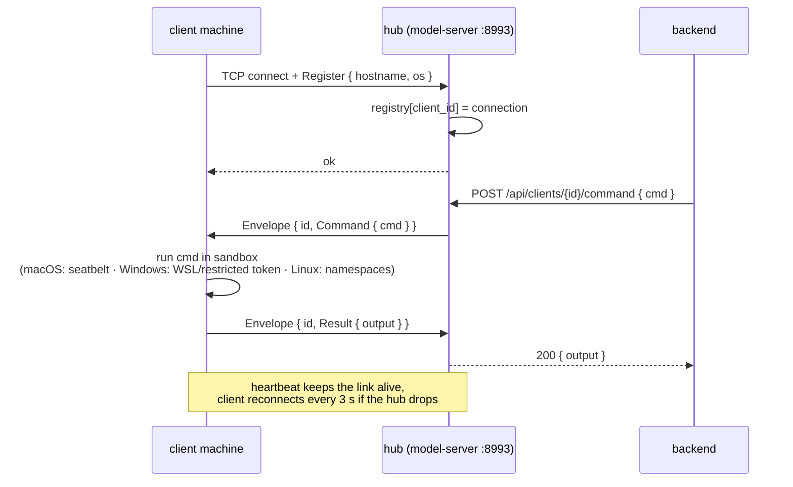
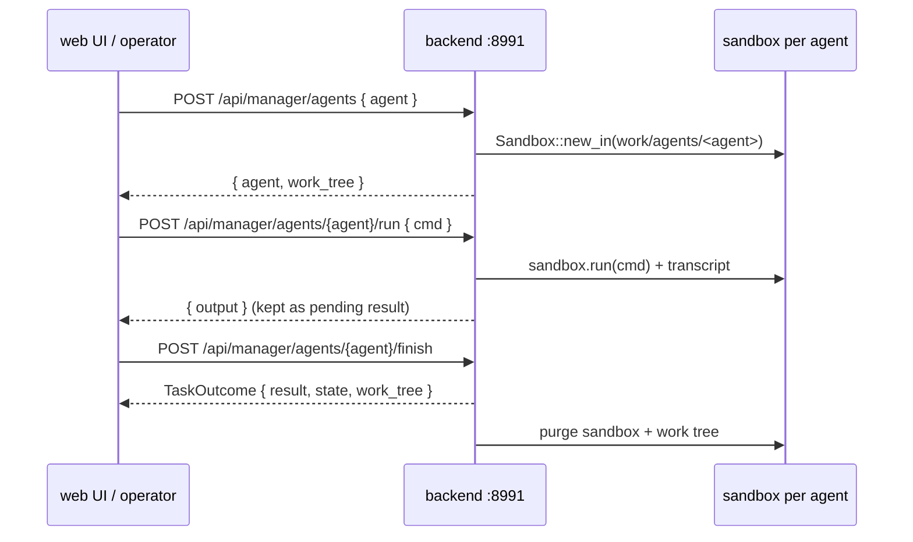
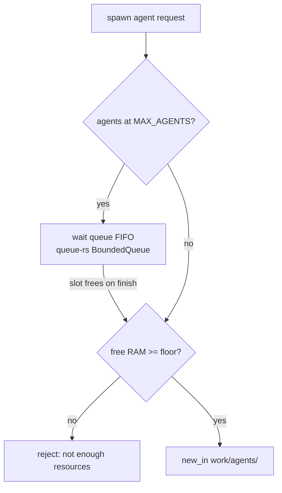
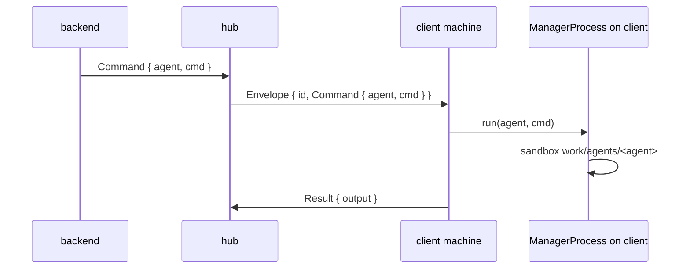
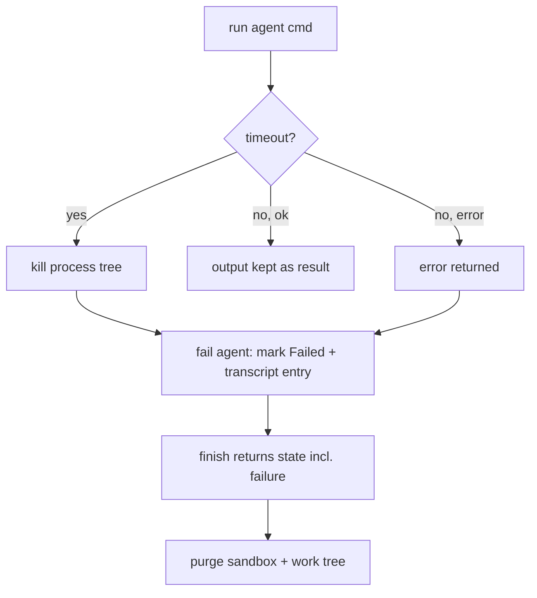

# Backend, client machines & web UI — usage & flow

Three kinds of machines:

- **backend** — the brain host: serves the web UI/API on :8991, runs the
  manager process (one sandbox per agent), and connects to `model-server`
  for inference. Never runs model code inline.
- **client machine** — runs the installed `backend` binary in *client mode*:
  it registers with the model-server hub over TCP and executes dispatched
  commands in its platform sandbox (macOS seatbelt, Linux namespaces,
  Windows WSL/restricted token). It runs no web UI and no models.
- **web UI** — any browser pointed at `http://<backend>:8991`; talks only to
  the backend, never to model-server or clients directly.

`model-server` stays a standalone box (inference + TCP hub) that both the
backend and client machines talk to.

## Machine overview


| Machine | Binary | Ports | Job |
|---|---|---|---|
| backend | `backend` | :8991 | web API, manager process (agent sandboxes), remote inference client |
| client machine | `backend` (client mode) | — | registers with hub, runs commands in sandbox |
| model-server | `model-server` | :8992 + :8993 | inference engine + client hub |
| web UI | browser | — | operator console |

## 1. Install flow (client machine)


## 2. Client machine: register & run dispatched commands (TCP, proto-rs)



## 3. Web UI → backend → model-server (inference)


## 4. Manager process on the backend — one sandbox per agent



- `spawn` is idempotent — an already-running agent keeps its work tree.
- Stale non-empty work trees (crashed run, backend restart) are reclaimed on
  the next spawn of the same agent name.
- `state` returned on finish carries the cwd + full transcript, ready to be
  persisted (e.g. into the kanban card's `agent_state`).

## 5. Commands

Backend machine (with a model server available):

```sh
./target/release/backend               # API :8991 + manager process + client node
```

Client machine (one line):

```sh
curl -fsSL "http://<backend-host>:8991/install.sh?role=auto&server=http://<model-server>:8992" | sh
```

Web UI: open `http://<backend-host>:8991` in a browser (vite dev: `make web`
on :5173, proxies to :8991).

Verify + drive a client machine:

```sh
curl http://<model-server>:8992/api/clients
curl -X POST http://<model-server>:8992/api/clients/<id>/command \
     -H 'content-type: application/json' -d '{"cmd":"echo hi"}'
```

Drive an agent sandbox on the backend:

```sh
curl http://localhost:8991/api/manager/agents
curl -X POST http://localhost:8991/api/manager/agents -H 'content-type: application/json' -d '{"agent":"fix-login"}'
curl -X POST http://localhost:8991/api/manager/agents/fix-login/run -H 'content-type: application/json' -d '{"cmd":"ls"}'
curl -X POST http://localhost:8991/api/manager/agents/fix-login/finish
```

Override points (env, no .env files): `MODEL_SERVER_HTTP_PORT`,
`MODEL_SERVER_TCP_PORT` (model-server) · `SUSUTAKU_MODEL_SERVER_URL`,
`SUSUTAKU_HUB_ADDR` (backend / client machine).

## 6. Known gaps & planned design

### 6.1 Resource check before running an agent (queue)

Today `ManagerProcess::spawn` checks only the in-memory agent map — no RAM
check, no cap, no queue. Planned:

- `MAX_AGENTS` cap (env-tunable) on concurrently running agent sandboxes.
- Free-RAM floor checked at spawn (same probe as the installer, in Rust:
  `sysctl hw.memsize` on macOS, `/proc/meminfo` on Linux).
- Spawns that arrive while at capacity go into a bounded wait queue
  (`queue-rs::BoundedQueue`) and start FIFO as running agents finish.



### 6.2 Agent-aware commands for client machines

Today the client-mode backend routes every hub command through one
process-global sandbox — the envelope carries no agent identity, so clients
cannot run per-agent work trees like the backend does. Planned:

- `proto-rs` `Kind::Command` gains an `agent: String` field.
- The client node keeps its own `ManagerProcess`; a command addressed to
  agent X runs in `work/agents/X` on the client, so dispatching
  `/api/clients/{id}/command` gives the same isolation as the backend's
  manager API.



### 6.3 Failure path for a wrong agent

Today a failing `run` returns `Err` but nothing records it, and only Windows
has a command timeout — a hung command blocks the agent's slot forever.
Recovery is passive (stale tree reclaimed on next spawn). Planned:

- Run-with-timeout on all platforms (macOS/Linux get the same
  `SandboxLimits.timeout_secs` idea Windows already has); on timeout the
  process tree is killed and the command fails.
- `fail(agent, reason)` path: marks the agent `Failed`, records the error
  into its transcript and pending result, then `finish` returns that state
  so callers can audit what went wrong.
- Startup sweep of orphaned `work/agents/*` dirs (agents not in the map),
  mirroring `AgentSandbox::sweep()`.


