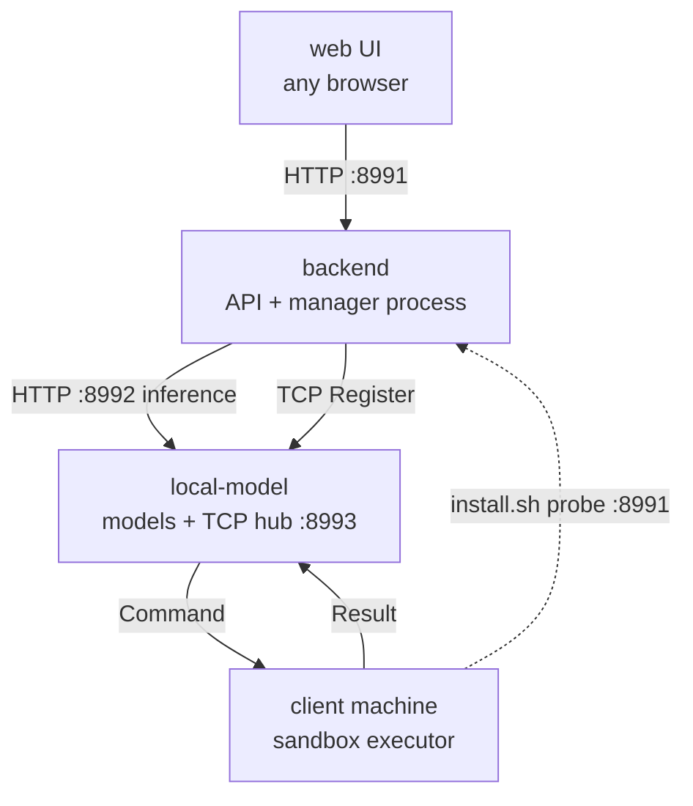
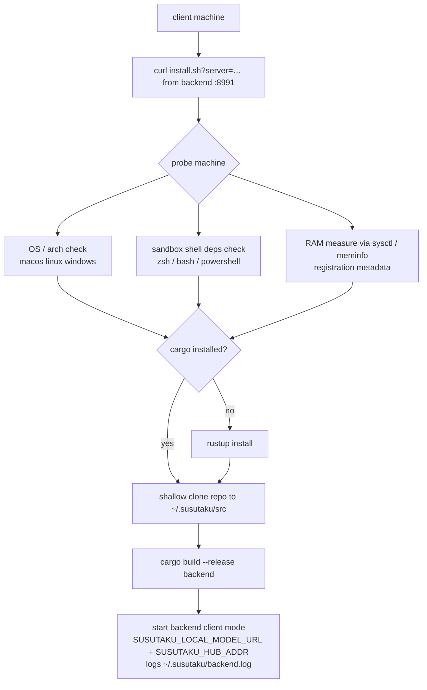
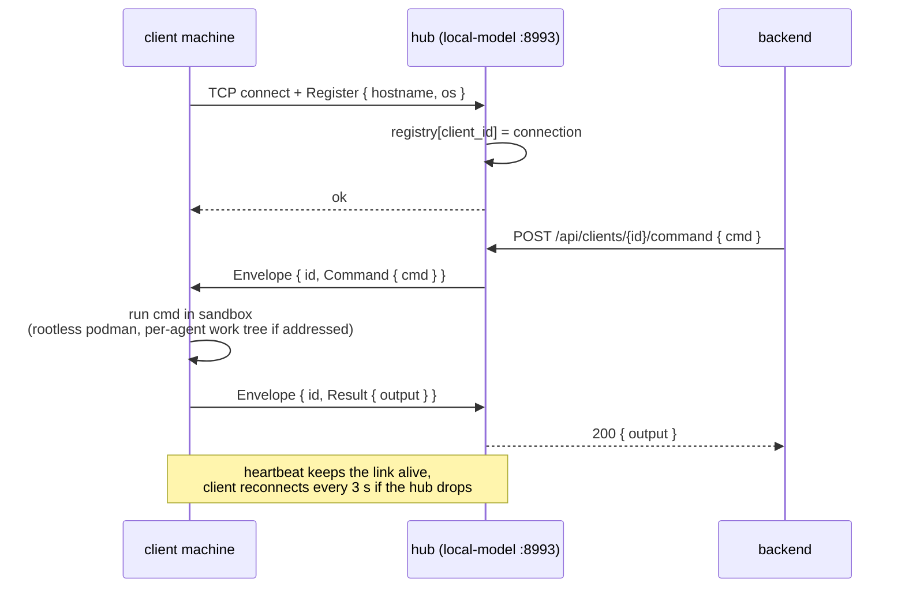
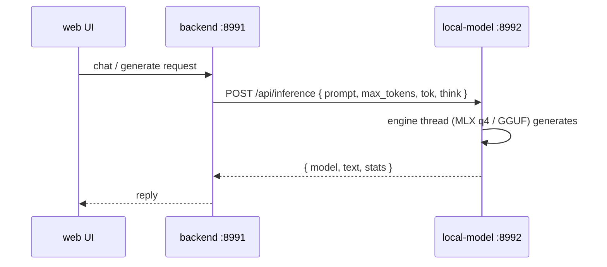
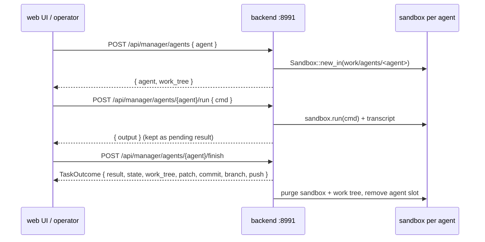
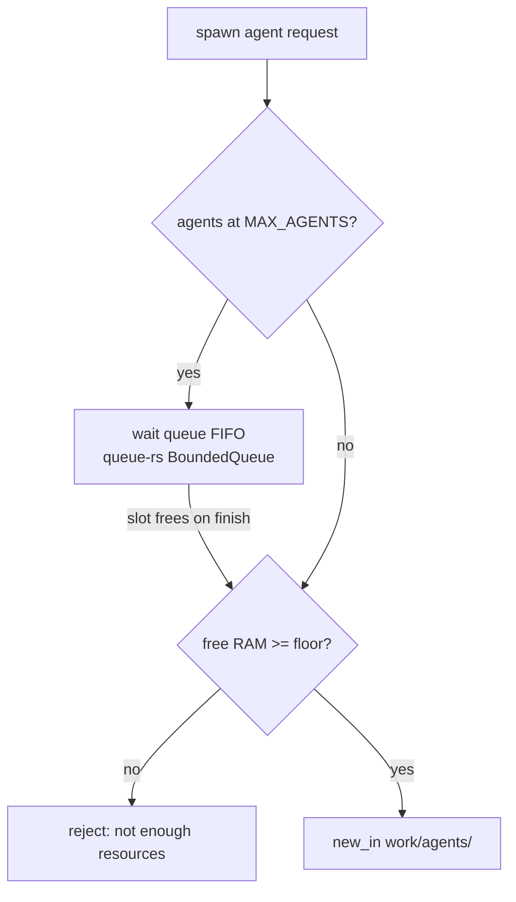
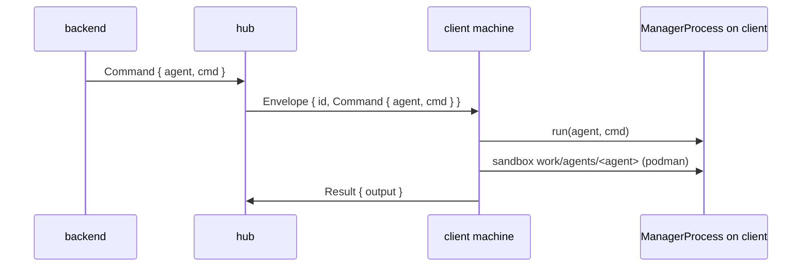
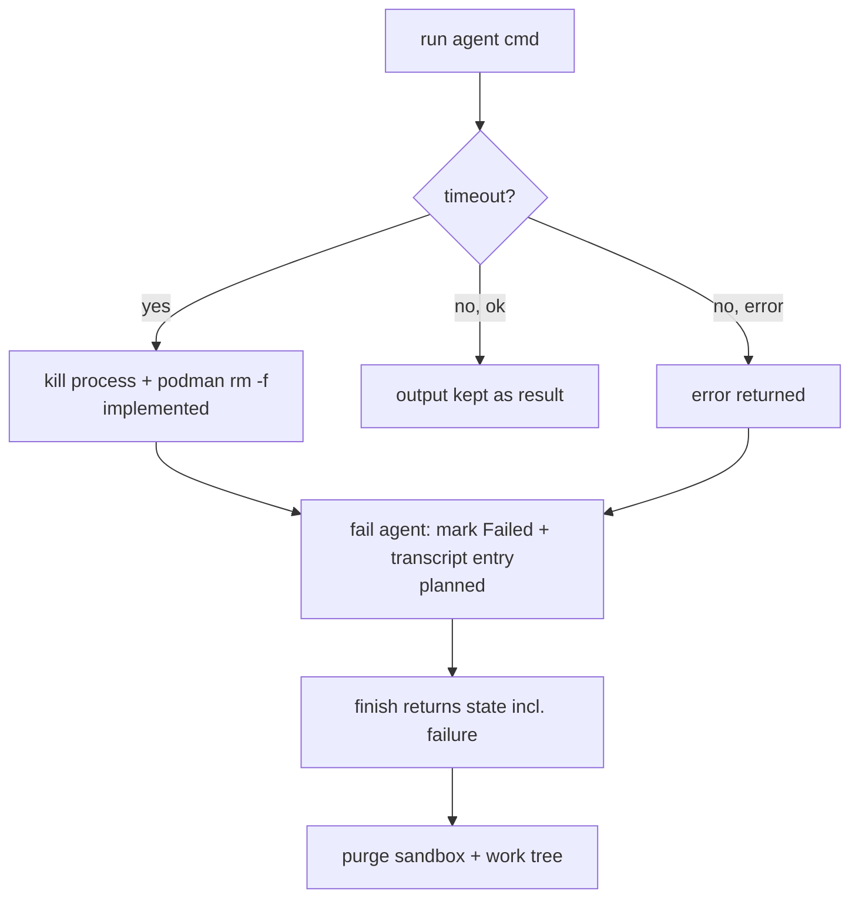

# Backend, client machines & web UI — usage & flow

Three kinds of machines:

- **backend** — the brain host: serves the web UI/API on :8991, runs the
  manager process (one sandbox per agent), and connects to `local-model`
  for inference. Never runs model code inline.
- **client machine** — runs the installed `backend` binary in *client mode*:
  it registers with the local-model hub over TCP and executes dispatched
  commands in the rootless podman sandbox (same as the backend — see
  `docs/podman-sandbox.md`). It runs no web UI and no models.
- **web UI** — any browser pointed at `http://<backend>:8991`; talks only to
  the backend, never to local-model or clients directly.

`local-model` stays a standalone box (inference + TCP hub) that both the
backend and client machines talk to.

## Machine overview



| Machine | Binary | Ports | Job |
|---|---|---|---|
| backend | `backend` | :8991 | web API, manager process (agent sandboxes), remote inference client |
| client machine | `backend` (client mode) | — | registers with hub, runs commands in sandbox |
| local-model | `local-model` | :8992 + :8993 | inference engine + client hub |
| web UI | browser | — | operator console |

## 1. Install flow (client machine)



The installer is runtime-only: every client machine installs the sandbox
client (worker) and inference comes from the server's model endpoint
(`SUSUTAKU_LOCAL_MODEL_URL`). No model is built or hosted on client machines.

## 2. Client machine: register & run dispatched commands (TCP, proto-rs)

Registration requires full machine metadata (`proto_rs::ClientMeta`:
hostname, os, arch, role, ram_gib). The installer measures `ram_gib` and
exports it as `SUSUTAKU_CLIENT_RAM_GIB` before launching the client node;
the client node registers as `worker`, refuses to run without the
metadata, and the hub closes the connection of any Register that carries
missing/invalid metadata.



## 3. Web UI → backend → local-model (inference)



## 4. Manager process on the backend — one sandbox per agent



- `spawn` is idempotent — an already-running agent keeps its work tree.
  Spawns can also carry a task (`spawn_task`): the slot key becomes
  `agent|task`, the tree is seeded (optionally by cloning a repo), and when
  the repo has commits a `task/<task>-<agent>` branch is checked out so
  task work lands isolated.
- The sandbox runs from the agent's cached image
  (`localhost/susutaku-agent-cache:<agent>` — each run is committed back
  into it), else the default coding image.
- Stale non-empty work trees (crashed run, backend restart) are reclaimed on
  the next spawn of the same agent name.
- `finish` captures the task patch first (`git-rs::task_patch`: commits
  pending work, diffs against the spawn-time base commit — or the empty
  tree on an unborn HEAD), optionally **pushes the branch before teardown**
  (`finish_with_push`; push failure does not fail the finish), then tears
  down the sandbox and its work tree and removes the slot. `state` carries
  the cwd + full transcript, ready to be persisted (e.g. into the task
  card's `agent_state`); `patch` + `commit` preserve the work as an
  artifact after the tree is gone.

## 5. Commands

Backend machine (with a local model server available):

```sh
./target/release/backend               # API :8991 + manager process + client node
```

Client machine (one line) — `server` is the backend URL; the installer expects
the local-model server on that same host at :8992:

```sh
curl -fsSL "http://<backend-host>:8991/install.sh?server=http%3A%2F%2F<backend-host>%3A8991" | sh
```

Web UI: open `http://<backend-host>:8991` in a browser (vite dev: `make web`
on :5173, proxies to :8991).

Verify + drive a client machine:

```sh
curl http://<local-model>:8992/api/clients
curl -X POST http://<local-model>:8992/api/clients/<id>/command \
     -H 'content-type: application/json' -d '{"cmd":"echo hi"}'
```

Drive an agent sandbox on the backend:

```sh
curl http://localhost:8991/api/agents/whereis/fix-login   # which machine holds the agent
curl http://localhost:8991/api/manager/agents
curl -X POST http://localhost:8991/api/manager/agents -H 'content-type: application/json' -d '{"agent":"fix-login"}'
curl -X POST http://localhost:8991/api/manager/agents/fix-login/run -H 'content-type: application/json' -d '{"cmd":"ls"}'
curl -X POST http://localhost:8991/api/manager/agents/fix-login/finish
```

Override points (env, no .env files): `LOCAL_MODEL_HTTP_PORT`,
`LOCAL_MODEL_TCP_PORT` (local-model) · `SUSUTAKU_LOCAL_MODEL_URL`,
`SUSUTAKU_HUB_ADDR` (backend / client machine).

## 6. Known gaps & planned design

### 6.1 Resource check before running an agent (queue)

Today `ManagerProcess::spawn` checks only the in-memory agent map — no RAM
check, no cap, no queue. Planned:

- `MAX_AGENTS` cap (env-tunable) on concurrently running agent sandboxes.
- Free-RAM floor checked at spawn (same probe as the installer, in Rust:
  `sysctl hw.memsize` on macOS, `/proc/meminfo` on Linux).
- Spawns that arrive while at capacity go into a bounded wait queue
  (`queue-rs::BoundedQueue`) and start FIFO as running agents finish.



### 6.2 Agent-aware commands for client machines — IMPLEMENTED

Implemented as of the podman sandbox work:

- `proto-rs` `Kind::Command` carries `agent: String` (empty = the
  process-global sandbox).
- The client node keeps a `ManagerProcess`: a command addressed to agent X
  spawns `work/agents/X` on the client and runs there (own work tree,
  transcript, podman sandbox).
- `POST /api/clients/{id}/command` accepts `{ cmd, agent }`.
- `GET /api/clients/{id}/agents` returns the agent names the client's manager
  holds (proto `Kind::AgentNames` → `AgentNamesResult` round trip).
- `POST /api/clients/{id}/kick` disconnects the client from the hub.
- New backend endpoints drive shared machines by hostname:
  `POST /api/machines/{hostname}/agents/{agent}/run { cmd }`.
- Web UI runtime modal (agent sandboxes tab) lists every machine with the
  agents it runs (`agents: …`) and its sandbox count; remote machines can be
  kicked (disconnected) from there.
  machines; picking one opens an agent console (agent name + command →
  output) that spawns/runs agents on that machine.
- Verified end-to-end by the client-test stack:
  `hub_stub` dispatches a global probe **and** an agent probe
  (`test-agent`) to every registering client;
  `docker compose -f docker/compose/client-test.yml logs hub | grep RESULT`
  must show `STUB-HUB-ROUNDTRIP` and `AGENT-ROUNDTRIP` from each client,
  and `work/agents/test-agent` must exist inside the client container.



### 6.3 Timeouts (implemented) & failure path (partly planned)

Run-with-timeout is **implemented on all platforms**: every sandbox command
runs under a host-side deadline (`SandboxLimits::timeout`, default 30 s) in
the podman runner — on timeout the container process is killed and a stray
container is force-removed (`podman rm -f`), so the command fails instead
of blocking forever. `manager-rs` git toolcalls pass their own longer limit
and run with network enabled.

Still missing / planned:

- A `fail(agent, reason)` path: today a failing `run` returns `Err` but
  nothing records it; recovery is passive (stale tree reclaimed on next
  spawn). Planned: mark the agent `Failed`, record the error into its
  transcript and pending result, and let `finish` return that state for
  audit.
- Startup sweep of orphaned `work/agents/*` dirs (agents not in the map),
  mirroring `AgentSandbox::sweep()`.


