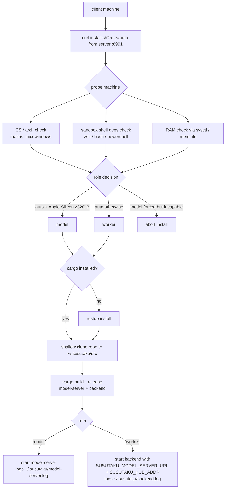
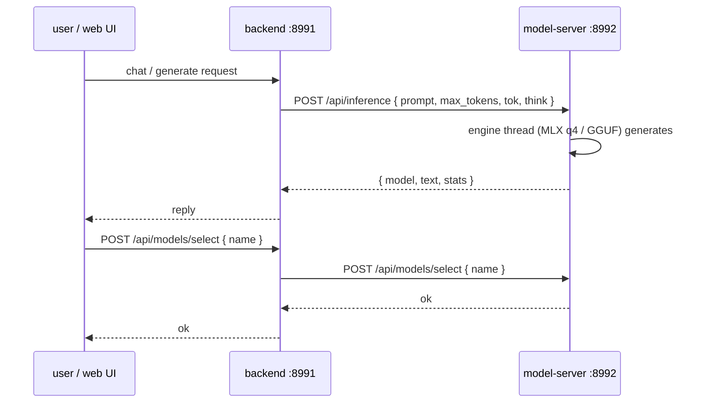

# Remote server / client machines — usage & flow

Architecture: one **server** hosts the models (`model-server`: inference HTTP
+ TCP command hub) and one or more **clients** register with it
(`backend` client node). The server dispatches process commands to clients;
each client runs them inside its platform sandbox and returns the output.
The web **backend** on any machine never runs model code inline — it is a
pure provider client of `model-server`.

## Machine roles

| Role | Binary | Runs | Register as |
|---|---|---|---|
| server (model host) | `model-server` | inference engine + command hub (HTTP :8992, TCP :8993) | — |
| worker client | `backend` | client node + sandbox (seatbelt / WSL / namespaces) | yes |
| model client | `model-server` | its own models + hub | n/a (it *is* a server) |
| web/app host | `backend` | HTTP API :8991 + client node, remote inference | yes |

## 1. Install flow (client machine)



## 2. Registration & command dispatch (TCP, proto-rs)

```mermaid
sequenceDiagram
    participant C as client (backend)
    participant H as hub (model-server :8993)
    participant S as server operator / API
    C->>H: TCP connect + Register { hostname, os }
    H->>H: registry[client_id] = connection
    H-->>C: ok
    S->>H: POST /api/clients/{id}/command { cmd }
    H->>C: Envelope { id, Command { cmd } }
    C->>C: run cmd in sandbox<br/>(macOS: seatbelt · Windows: WSL/restricted token · Linux: namespaces)
    C->>H: Envelope { id, Result { output } }
    H-->>S: 200 { output }
    Note over C,H: heartbeat ping/pong keeps the link alive;<br/>client reconnects every 3 s if the hub drops
```

## 3. Inference flow (no inline model code anywhere else)



## 4. Commands

Server machine (with a downloaded model):

```sh
make download-model                    # ≥30 GiB 4-bit MLX checkpoint into models/
./target/release/model-server          # HTTP :8992 + hub :8993
```

Client machine (one line):

```sh
curl -fsSL "http://<server>:8991/install.sh?role=auto&server=http://<server>:8992" | sh
```

Verify + drive a client from the server:

```sh
curl http://localhost:8992/api/clients
curl -X POST http://localhost:8992/api/clients/<id>/command \
     -H 'content-type: application/json' -d '{"cmd":"echo hi"}'
```

Override points (env, no .env files): `MODEL_SERVER_HTTP_PORT`,
`MODEL_SERVER_TCP_PORT` (server) · `SUSUTAKU_MODEL_SERVER_URL`,
`SUSUTAKU_HUB_ADDR` (client).
